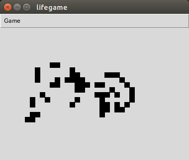

lifegame
========

An implementation of Conway's game of life in python.

Introduction
------------

Tk-based Conway's game of life.

How to play
------------

Make sure to install 'python-tk' package. Then run:

    python lifegame/gui.py

