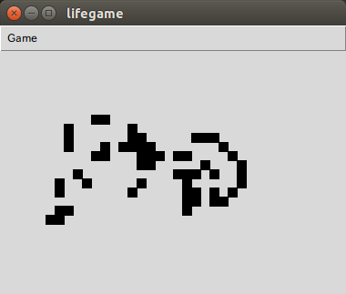
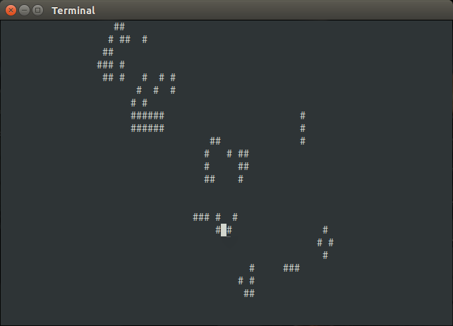

lifegame
========

An implementation of Conway's game of life in python.

Introduction
------------

Tk-based Conway's game of life.

How to play
------------

### Graphical Interface

Make sure to install 'python-tk' package. Then run:

    python lifegame/gui.py

### Text Interface

run:

    python lifegame/tui.py

In window, use `hjkl` to move, `<Space>` to toggle cell, `<Enter>` to step execution then `q` to exit.

